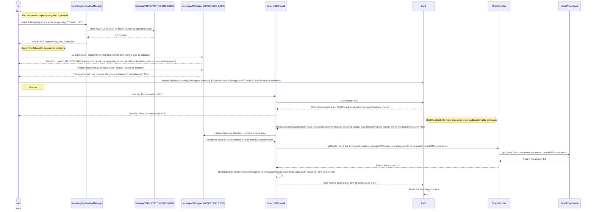

```mermaid
sequenceDiagram
    actor Alice

    participant NonFungiblePositionManager
    participant Pool as UniswapV3Pool WETH/USDC 0.05%
    participant Wrapper as UniswapV3Wrapper WETH/USDC 0.05%
    participant Vault as Euler USDC vault
    participant EVC
    participant OracleRouter
    participant FixedPriceOracle

    Note right of Alice: Mint the tokenId representing the LP position
    Alice->>NonFungiblePositionManager: `mint` Add liquidity to a specific range using ETH and USDC


    NonFungiblePositionManager->>Pool: `mint` Open LP position on behalf of Alice at specified range
    Pool-->>NonFungiblePositionManager: LP position
    NonFungiblePositionManager-->>Alice: Mint an NFT representing the LP position

    Note right of Alice: Supply the tokenId to be used as collateral
    Alice->>Wrapper: `wrap(tokenId)` Supply the minted tokenId that they want to use as collateral
    Wrapper-->>Alice: Mint FULL_AMOUNT of ERC6909 tokens with tokenId representing full control of the tokenId that was just supplied (wrapped)
    Alice->>Wrapper: `enableTokenIdAsCollateral(tokenId)` Enable tokenId as collateral
    Wrapper-->>Alice: The wrapper will now consider the value of tokenId in the balanceOf Alice

    Alice->>EVC: `enableCollateral(UniswapV3Wrapper address)` Enable UniswapV3Wrapper WETH/USDC 0.05% vault as collateral
    Note right of Alice: Borrow
    Alice->>Vault: `borrow` Borrow some USDC
    Vault->>EVC: Call through EVC
    EVC-->>Vault: Optimistically asks Euler USDC vault to allow borrowing without any checks
    Vault-->>Alice: `transfer` Send the borrowed USDC

    Note right of EVC: Start the checks to make sure Alice is not underwater after borrowing
    EVC->>Vault: `checkAccountStatus(account: alice, collaterals: array of enabled collateral vaults)` Ask the Euler USDC vault to check the account status of Alice

    Vault->>Wrapper: `balanceOf(alice)` Get the current balance of Alice
    Wrapper-->>Vault: The current value of each enabled tokenId in unitOfAccount terms

    Vault->>OracleRouter: `getQuote` Send the amount returned by UniswapV3Wrapper to oracle router to be converted to unitOfAccount terms
    OracleRouter->>FixedPriceOracle: `getQuote` Ask it to convert the amount to unitOfAccount terms
    FixedPriceOracle-->>OracleRouter: Return the amount 1:1
    OracleRouter-->>Vault: Return the amount 1:1

    Vault->>Vault: `checkLiquidity` Ensure collateral value in unitOfAccount terms ≥ borrowed value (with liquidation LTV considered)
    Vault-->>EVC: Fail if Alice is underwater, give all clear if Alice is not
    EVC-->>EVC: Finish the borrowing process
```
